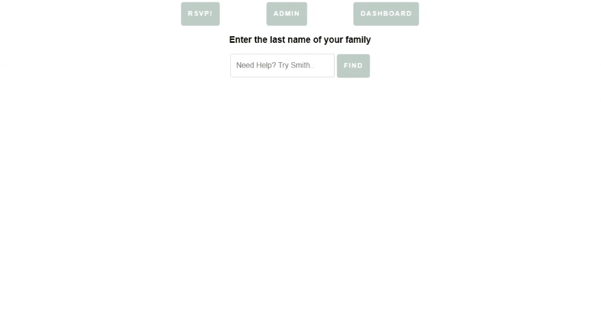

### Simple RSVP Application 🥳 🚀
- RSVP application built with a MERN stack to provide a clean way RSVP to your next event!
- Visit Site [https://rsvper.netlify.app/](https://rsvper.netlify.app/).

---

 

# 🧐 The Why

> This RSVP app is meant to be a very light weight way to enable full featured RSVP tracker.

# 👨‍💻 Tech stack

Here's a brief high-level overview of the tech stack the RSVP app uses:

- This project uses the [MERN](https://www.mongodb.com/mern-stack). The MERN architecture allows you to easily construct a 3-tier architecture (frontend, backend, database) entirely using JavaScript and JSON.
- For persistent storage, the app uses the [MongoDB](https://www.mongodb.com/). This app uses a simple storage schema and saves it to a local database.
- For communication to the backend, the app uses [Node.js](https://nodejs.org/en/about/).

 

---
